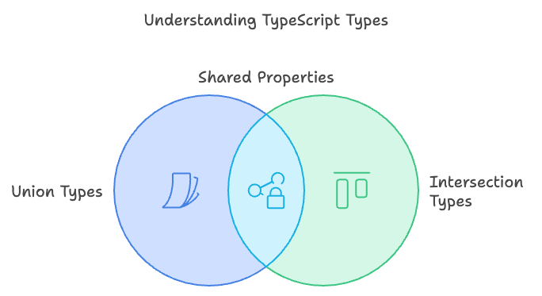

# The Significance of Union and Intersection Types in TypeScript



TypeScript, a superset of JavaScript, introduces several powerful features to enhance the development experience. Among these features, union and intersection types stand out for their ability to create flexible and expressive type definitions.

## Union Types

Union types allow a variable to hold more than one type. This is particularly useful when a value can be one of several types. For example:

```typescript
let value: string | number
value = 'This is Fahad Kabir'
value = 24
```

In this example, the variable `value` can be either a `string` or a `number`. Union types are beneficial when dealing with functions that can accept multiple types of arguments or when working with APIs that return different types of data.

### Use Cases for Union Types

1. **Function Parameters**: Functions that can accept multiple types of arguments.
2. **API Responses**: Handling responses that can return different types of data.
3. **Event Handling**: Managing events that can have different payloads.

## Intersection Types

Intersection types, on the other hand, combine multiple types into one. This means that a variable must satisfy all the combined types. For example:

```typescript
interface Student {
  name: string
}

interface StudentId {
  studentId: number
}

interface University {
  university: string
}

type StudentDetails = Student & StudentId & University

const student: StudentDetails = {
  name: 'Fahad Kabir',
  studentId: 2003143,
  university: 'CUET',
}
```

In this example, the `StudentDetails` type must have both `name` and `studentId` & `university` properties. Intersection types are useful for creating objects that need to conform to multiple interfaces.

### Use Cases for Intersection Types

1. **Combining Interfaces**: Creating objects that need to satisfy multiple interfaces.
2. **Mixin Patterns**: Implementing mixin patterns where an object needs to have properties from multiple sources.
3. **Type Composition**: Building complex types from simpler ones.

## Conclusion

Union types allow for variables to hold multiple types, making them versatile for various scenarios. Intersection types enable the combination of multiple types, ensuring that variables meet all required criteria.
